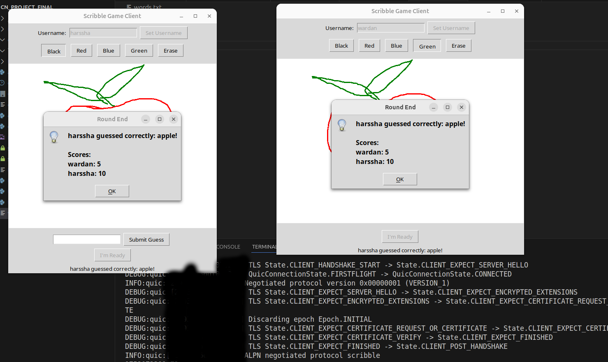
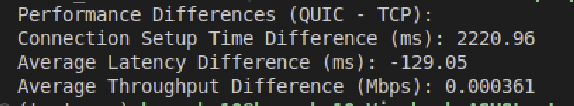

# Scribble game with QUIC,TCP connection 
## About the project:
An analysis project for QUIC(Quick UDP Internet Connections) protocol for game networking ,we can see the difference between connection establishment time for TCP and QUIC using 0-RTT, other than that QUIC can establish multiple streams via single connection,
there will be no notable difference between latencies compared to other protocols.Since each stroke is independent ,we can use multistreaming to send packets.

### **Game will be changed to something which transfers large data packets utilizing mutiple streams in the future**

## About Scribble :
* each round a player gets to draw an object and other players get to guess the word through chat.
* players who get to draw are chosen in cyclic order and points are distributed for guessing and drawing(based on number of people who could guess)

## Requirements:
aioquic>=1.2.0 <br />
OpenSSL>=3.0.13<br />
matplotlib>=3.10.1<br />
numpy>=2.2.4<br />
pandas>=2.2.3

generate server and client certificates using openssl for quic connection establishment:
```
openssl req -x509 -newkey rsa:2048 -keyout server_key.pem -out server_cert.pem -days 365 -nodes -addext "subjectAltName = DNS:localhost"
```
## Analysis:
Analysis is done by opening and establishing connection to public ports using [Playit.gg free tcp,udp ports](https://playit.gg/). and tunneling them to local ports where the server is running,for capturing  real network scenarios.

## drawing:

## guessing:

## metrics:

